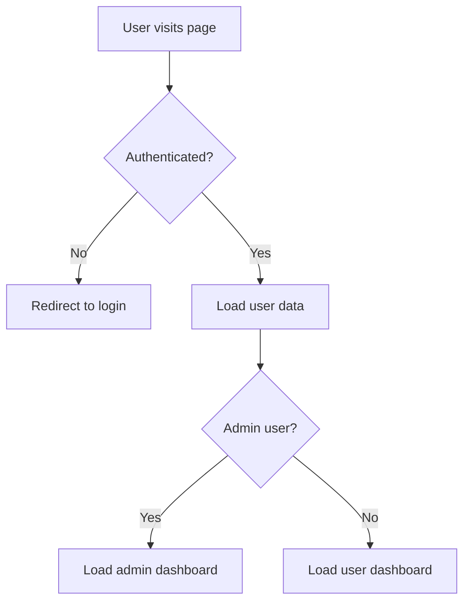
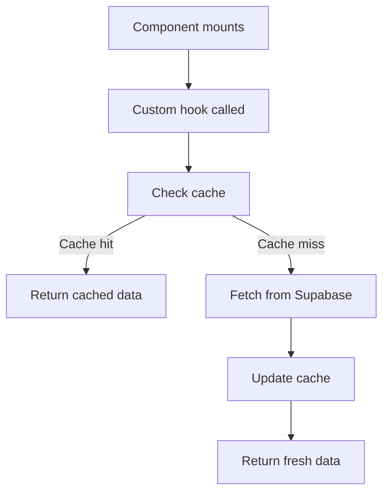

# System Patterns - Nunuza Architecture

## Overall Architecture Pattern
**Modern JAMstack with Server-Side Rendering** - Next.js 14 with App Router providing server-side rendering, static generation, and client-side hydration for optimal performance and SEO.

## Component Architecture

### Layout Structure
```
src/
├── app/                    # Next.js App Router
│   ├── (auth)/            # Authentication pages
│   ├── (main)/            # Main application pages
│   ├── admin/             # Admin-only pages
│   └── globals.css        # Global styles
├── components/            # Reusable UI components
│   ├── layout/           # Layout components (Header, Footer)
│   ├── home/             # Homepage-specific components
│   └── ui/               # Generic UI components
├── hooks/                # Custom React hooks
├── lib/                  # Utility libraries
├── stores/               # State management
├── types/                # TypeScript definitions
└── locales/              # Translation files
```

### Component Patterns

#### Page Components Pattern
```typescript
// Standard page structure
export default function PageName() {
  const { data, loading, error } = useCustomHook();
  
  if (loading) return <LoadingSpinner />;
  if (error) return <ErrorMessage error={error} />;
  
  return (
    <div className="container mx-auto px-4 py-8">
      <PageHeader />
      <PageContent data={data} />
    </div>
  );
}
```

#### Custom Hook Pattern
```typescript
// Data fetching hooks
export function useDataHook() {
  const [data, setData] = useState(null);
  const [loading, setLoading] = useState(true);
  const [error, setError] = useState(null);
  
  // Fetch logic with error handling
  // Return { data, loading, error, refetch }
}
```

## Database Architecture

### Schema Design Pattern
**Normalized Relational Design** with clear entity relationships and proper indexing.

#### Core Entities
- **Users**: Central user management with authentication
- **Posts**: Marketplace listings with rich metadata
- **Categories**: Hierarchical categorization system
- **Countries/Cities**: Geographic location management
- **Admins**: Separate admin role management

#### Relationship Patterns
```sql
-- One-to-Many: User has many Posts
users (1) -> (many) posts

-- One-to-Many: Country has many Cities
countries (1) -> (many) cities

-- One-to-Many: Category has many Posts
categories (1) -> (many) posts

-- Many-to-Many: Users can favorite many Posts
users <- favorites -> posts
```

### Security Patterns

#### Row-Level Security (RLS)
```sql
-- User data access pattern
CREATE POLICY "Users can view own data" ON users
  FOR SELECT USING (auth.uid() = id);

-- Post visibility pattern
CREATE POLICY "Public posts visible to all" ON posts
  FOR SELECT USING (status = 'active');

-- Admin access pattern
CREATE POLICY "Admins can manage users" ON users
  FOR ALL USING (is_admin(auth.uid()));
```

## State Management Patterns

### Global State (Zustand)
```typescript
// Auth Store Pattern
interface AuthState {
  user: User | null;
  isAuthenticated: boolean;
  signIn: (user: User) => void;
  signOut: () => void;
}

// App Store Pattern
interface AppState {
  language: Language;
  country: Country;
  currency: Currency;
  theme: Theme;
  setLanguage: (lang: Language) => void;
  setCountry: (country: Country) => void;
}
```

### Server State (Custom Hooks)
```typescript
// Server state pattern with caching
export function useServerData<T>(
  key: string,
  fetcher: () => Promise<T>
) {
  // React Query-like pattern
  // Handle loading, error, caching, refetching
}
```

## UI/UX Patterns

### Design System
**Brand-Consistent Component Library** with standardized colors, spacing, and typography.

#### Color System
```css
:root {
  --primary-blue: #2D4B73;
  --secondary-blue: #253C59;
  --accent-blue: #99B4BF;
  --primary-gold: #D9B70D;
  --secondary-gold: #BF8D30;
}
```

#### Component Styling Pattern
```typescript
// Utility-first with brand colors
const Button = ({ variant = 'primary', ...props }) => {
  const baseClasses = 'px-6 py-3 rounded-lg font-medium transition-colors';
  const variants = {
    primary: 'bg-primary-blue text-white hover:bg-secondary-blue',
    secondary: 'bg-primary-gold text-white hover:bg-secondary-gold',
    outline: 'border border-primary-blue text-primary-blue hover:bg-primary-blue hover:text-white'
  };
  
  return (
    <button className={`${baseClasses} ${variants[variant]}`} {...props} />
  );
};
```

### Responsive Design Pattern
**Mobile-First Approach** with progressive enhancement for larger screens.

```css
/* Mobile-first breakpoints */
.container {
  @apply px-4 mx-auto;
}

@media (min-width: 640px) {
  .container {
    @apply px-6;
  }
}

@media (min-width: 1024px) {
  .container {
    @apply px-8 max-w-6xl;
  }
}
```

## Data Flow Patterns

### Authentication Flow


### Data Fetching Flow


## Error Handling Patterns

### Client-Side Error Handling
```typescript
// Error boundary pattern
class ErrorBoundary extends React.Component {
  constructor(props) {
    super(props);
    this.state = { hasError: false, error: null };
  }
  
  static getDerivedStateFromError(error) {
    return { hasError: true, error };
  }
  
  render() {
    if (this.state.hasError) {
      return <ErrorFallback error={this.state.error} />;
    }
    return this.props.children;
  }
}
```

### API Error Handling
```typescript
// Standardized error response pattern
interface ApiError {
  code: string;
  message: string;
  details?: any;
}

// Error handling in hooks
try {
  const data = await supabase.from('table').select();
  if (data.error) throw new Error(data.error.message);
  return data.data;
} catch (error) {
  toast.error(error.message);
  throw error;
}
```

## Performance Patterns

### Loading Strategies
```typescript
// Optimistic loading pattern
const [optimisticData, setOptimisticData] = useState(null);

const handleSubmit = async (data) => {
  setOptimisticData(data); // Show immediately
  try {
    await submitData(data);
  } catch (error) {
    setOptimisticData(null); // Rollback on error
    throw error;
  }
};
```

### Code Splitting Pattern
```typescript
// Lazy loading for route components
const AdminDashboard = lazy(() => import('./AdminDashboard'));
const CategoryPage = lazy(() => import('./CategoryPage'));

// Wrap in Suspense
<Suspense fallback={<LoadingSpinner />}>
  <AdminDashboard />
</Suspense>
```

## Internationalization Patterns

### Translation Management
```typescript
// Hook-based translation pattern
const { t, i18n } = useTranslation();

// Namespace-based organization
const categoryNames = t('categories.electronics', { 
  defaultValue: 'Electronics' 
});

// Dynamic translations with parameters
const welcomeMessage = t('welcome', { 
  name: user.name,
  count: posts.length 
});
```

### Language Switching Pattern
```typescript
// Global language state with persistence
const changeLanguage = (newLang: Language) => {
  i18n.changeLanguage(newLang);
  localStorage.setItem('language', newLang);
  // Update currency and country if needed
  if (newLang === 'sw') setCountry('Tanzania');
  if (newLang === 'fr') setCountry('Rwanda');
};
```

## Security Patterns

### Authentication Security
- **JWT Token Management**: Secure storage and automatic refresh
- **Route Protection**: Server-side authentication checks
- **Role-Based Access**: Database-level permission enforcement

### Data Validation
```typescript
// Zod schema validation pattern
const PostSchema = z.object({
  title: z.string().min(3).max(100),
  price: z.number().positive(),
  category: z.string().uuid(),
  // ... other fields
});

// Form validation
const { handleSubmit, formState: { errors } } = useForm({
  resolver: zodResolver(PostSchema)
});
```

## Development Patterns

### File Naming Convention
- **Components**: PascalCase (e.g., `UserProfile.tsx`)
- **Hooks**: camelCase with `use` prefix (e.g., `useUserData.ts`)
- **Utilities**: camelCase (e.g., `formatCurrency.ts`)
- **Types**: PascalCase with descriptive names (e.g., `UserProfile.ts`)

### Import Organization
```typescript
// React imports first
import React, { useState, useEffect } from 'react';

// Third-party imports
import { useTranslation } from 'react-i18next';
import { toast } from 'react-hot-toast';

// Local imports (absolute paths)
import { Button } from '@/components/ui/Button';
import { useAuth } from '@/hooks/useAuth';
import { User } from '@/types/database';
```

This system architecture provides a scalable, maintainable foundation for the Nunuza marketplace platform. 