# 🚀 Nunuza - אפיון מערכת מקיף ומסועף
## לוח מודעות דיגיטלי לאפריקה - מפרט טכני מלא

---

## 📋 תוכן עניינים
1. [חזון ומטרות](#חזון-ומטרות)
2. [מחקר שוק ותחרות](#מחקר-שוק-ותחרות)
3. [קהל יעד ופרסונות](#קהל-יעד-ופרסונות)
4. [מפת הבעיה והפתרון](#מפת-הבעיה-והפתרון)
5. [דרישות פונקציונליות](#דרישות-פונקציונליות)
6. [ארכיטקטורה טכנית](#ארכיטקטורה-טכנית)
7. [מסד נתונים מפורט](#מסד-נתונים-מפורט)
8. [זרימות משתמש](#זרימות-משתמש)
9. [ממשק משתמש](#ממשק-משתמש)
10. [אבטחה ופרטיות](#אבטחה-ופרטיות)
11. [ריבוי שפות ומדינות](#ריבוי-שפות-ומדינות)
12. [אינטגרציות חיצוניות](#אינטגרציות-חיצוניות)
13. [מודל עסקי ומוניטיזציה](#מודל-עסקי-ומוניטיזציה)
14. [תוכנית שיווק](#תוכנית-שיווק)
15. [מדדי הצלחה](#מדדי-הצלחה)
16. [היבטים משפטיים](#היבטים-משפטיים)
17. [תוכנית פיתוח](#תוכנית-פיתוח)
18. [ניהול סיכונים](#ניהול-סיכונים)
19. [תוכנית ההשקה](#תוכנית-ההשקה)
20. [חזון עתידי](#חזון-עתידי)

---

## 🎯 חזון ומטרות

### חזון
**להפוך לפלטפורמת הסחר הדיגיטלית המובילה באפריקה** - לוח מודעות נגיש, רב-לשוני ומותאם תרבותית שמאפשר לכל אדם באפריקה לקנות, למכור ולהתחבר לקהילה המקומית שלו.

### מטרות עסקיות
- **שנה 1**: 100,000 משתמשים פעילים, 50,000 מודעות באוגנדה
- **שנה 2**: הרחבה ל-3 מדינות נוספות, 500,000 משתמשים
- **שנה 3**: 10 מדינות, מיליון משתמשים, רווחיות מלאה
- **שנה 5**: פלטפורמה מובילה ב-20 מדינות באפריקה

### מטרות טכניות
- זמן טעינה: מתחת ל-3 שניות ברשת 3G
- זמינות: 99.9% uptime
- תמיכה: 500,000 משתמשים במקביל
- אבטחה: אפס פרצות מידע

---

## 📊 מחקר שוק ותחרות

### התחרות הקיימת
| פלטפורמה | נוכחות באפריקה | חוזקות | חולשות | איך נתמודד |
|-----------|----------------|---------|---------|------------|
| **OLX** | ניגריה, קניה, גאנה | מותג חזק, משאבים | לא מותאם מקומית | אינטגרציה עמוקה עם טלגרם |
| **Jiji** | ניגריה, קניה, אוגנדה | עיצוב טוב | מועט אינטגרציות מקומיות | שילוב עם תשלומים מקומיים |
| **PigiaMe** | קניה, תנזניה | מכירות רכב חזקות | ממשק מיושן | UX מודרני ומהיר |
| **Tonaton** | גאנה | נוכחות מוקדמת | מועט תכונות | בוט טלגרם אוטומטי |

### הזדמנויות שוק
- **74% מהאוכלוסייה באפריקה** מתחת לגיל 35
- **456 מיליון** משתמשי אינטרנט נייד
- **67%** מהעסקים הם עסקים קטנים בלתי פורמליים
- **עלייה של 23% בשנה** בסחר אלקטרוני

---

## 👥 קהל יעד ופרסונות

### פרסונה 1: **אמלי - סטודנטית** (23, קמפלה)
- **צרכים**: למכור מדי פעם ציוד לימודים, לקנות בגדים בזול
- **מכשירים**: סמארטפון אנדרואיד, אינטרנט ברחוב/אוניברסיטה
- **שפות**: אנגלית + לוגנדה
- **התנהגות**: משתמשת בטלגרם יומיומית, WhatsApp לחברים

### פרסונה 2: **דייוויד - נהג טקסי** (34, אנטבה)
- **צרכים**: למכור/לקנות רכבים, חלקי חילוף, שירותי תחזוקה
- **מכשירים**: טלפון בסיסי עם אינטרנט חלקי
- **שפות**: אנגלית פשוטה + לוגנדה
- **התנהגות**: יעדיף טלפון על אפליקציות

### פרסונה 3: **גרייס - בעלת עסק קטן** (41, מברארה)
- **צרכים**: לפרסם מוצרים בזול, לקבל לידים
- **מכשירים**: סמארטפון, מחשב בבית
- **שפות**: אנגלית + רואנדה
- **התנהגות**: פעילה ברשתות חברתיות, משתמשת ב-Mobile Money

### פרסונה 4: **ז'אן - מבקר מחו"ל** (28, פריס→קמפלה)
- **צרכים**: לקנות ציוד מקומי, למצוא שירותים
- **מכשירים**: iPhone, אינטרנט מהיר
- **שפות**: צרפתית + אנגלית
- **התנהגות**: מצפה לממשק מהיר ובטוח

---

## 🗺️ מפת הבעיה והפתרון

### 🔴 בעיות קיימות
| בעיה | השפעה | תדירות | חומרה |
|------|-------|---------|--------|
| חוסר פלטפורמה מאוחדת | משתמשים מפוזרים | גבוהה | קריטית |
| מחסום שפה | החרגת קהלים | גבוהה | גבוהה |
| חוסר אמון במוכרים | עסקאות נכשלות | בינונית | גבוהה |
| אינטרנט איטי/יקר | נשירה גבוהה | גבוהה | בינונית |
| חוסר תשלומים מקומיים | עסקאות מורכבות | גבוהה | בינונית |

### 🟢 פתרונות של Nunuza
| פתרון | יתרון תחרותי | קלות יישום |
|--------|---------------|-------------|
| **טלגרם כפלטפורמה ראשית** | אף אחד לא עושה את זה | קל |
| **3 שפות מקומיות** | מותאמות לקהל היעד | בינוני |
| **מערכת reputation** | בניית אמון | בינוני |
| **PWA + אתר מהיר** | עובד גם על חיבור חלש | קל |
| **Mobile Money integration** | תשלומים מקומיים | קשה |

---

## ⚙️ דרישות פונקציונליות

### 🟦 פונקציות ליבה (MVP)
1. **הרשמה והתחברות**
   - רישום דרך טלגרם (Telegram Login Widget)
   - רישום דרך טלפון (SMS OTP)
   - רישום דרך אימייל + סיסמה
   - התחברות דרך Google/Facebook (שלב 2)

2. **ניהול פרופיל משתמש**
   - שינוי פרטים אישיים
   - בחירת שפת ממשק
   - הגדרת מיקום (מדינה + עיר)
   - העלאת תמונת פרופיל
   - הגדרת שיטות קשר מועדפות

3. **פרסום מודעות**
   - בחירת קטגוריה מתוך 15 קטגוריות ראשיות
   - מילוי פרטי מודעה (כותרת, תיאור, מחיר)
   - העלאת עד 10 תמונות
   - הגדרת מיקום (מדינה, עיר, שכונה)
   - בחירת שיטות יצירת קשר
   - שמירה כטיוטה / שליחה לאישור

4. **דפדוף וחיפוש מודעות**
   - צפייה לפי קטגוריות
   - סינון לפי מיקום, מחיר, תאריך
   - חיפוש טקסט חופשי
   - מיון לפי: חדשות, מחיר, פופולריות
   - שמירת מודעות למועדפים

5. **עמוד מודעה יחידה**
   - גלריית תמונות עם זום
   - כל פרטי המודעה
   - פרטי המפרסם (שם, ציון אמינות)
   - כפתורי יצירת קשר (טלגרם, טלפון, WhatsApp)
   - כפתור שיתוף
   - אפשרות דיווח על מודעה

### 🟨 פונקציות ניהול (Admin)
1. **פאנל ניהול מודעות**
   - רשימת מודעות ממתינות לאישור
   - צפייה מוקדמת במודעה
   - אישור/דחייה עם הודעה למשתמש
   - עריכת מודעות (במקרי צורך)
   - מחיקת מודעות לא הולמות

2. **ניהול משתמשים**
   - רשימת משתמשים + פרטים
   - חסימת/ביטול חסימת משתמשים
   - עריכת ציוני אמינות
   - שליחת הודעות למשתמשים

3. **ניהול תוכן**
   - עריכת קטגוריות
   - ניהול רשימת מדינות וערים
   - עדכון תרגומים
   - ניהול תמונות ברירת מחדל

### 🟩 פונקציות מתקדמות (שלב 2)
1. **מערכת הודעות פנימית**
2. **מערכת ביקורות ודירוגים**
3. **מודעות ממומנות**
4. **אינטגרציה עם WhatsApp Business**
5. **מערכת תשלומים מקומיים**

---

## 🏗️ ארכיטקטורה טכנית

### Frontend Stack
```javascript
// טכנולוגיות ליבה
- Next.js 14 (App Router) - SSR/SSG for SEO
- TypeScript - Type safety
- Tailwind CSS - Responsive design
- React Hook Form + Zod - Form validation
- Zustand - State management
- React Query - Server state management
- react-i18next - Internationalization

// UI Components
- Headless UI - Accessible components
- React Hot Toast - Notifications
- Framer Motion - Animations
- React Image Gallery - Image viewing
- React Select - Advanced selects

// PWA & Performance
- next-pwa - Progressive Web App
- next-optimized-images - Image optimization
- next-bundle-analyzer - Bundle analysis
```

### Backend Architecture
```javascript
// Primary Backend
- Supabase (PostgreSQL + Auth + Storage + Edge Functions)

// External Services
- Cloudinary - Image storage & optimization
- Telegram Bot API - Bot integration
- Twilio - SMS authentication
- SendGrid - Email notifications

// Deployment & CDN
- Vercel - Frontend hosting
- Cloudflare - CDN & security
- Upstash Redis - Caching layer
```

### Database Design Philosophy
- **Single Source of Truth**: Supabase PostgreSQL
- **Relational Integrity**: Foreign keys with cascades
- **Soft Deletes**: Never hard delete user data
- **Audit Trail**: Track all changes with timestamps
- **Scalability**: Designed for 1M+ records per table

---

## 🗄️ מסד נתונים מפורט

### Schema Overview
```sql
-- Core Tables
users, posts, categories, countries, cities

-- Feature Tables  
favorites, reports, notifications, admin_actions

-- Analytics Tables
page_views, search_queries, user_sessions

-- Configuration Tables
app_settings, translations, featured_posts
```

### 👤 Table: users
```sql
CREATE TABLE users (
  id UUID PRIMARY KEY DEFAULT gen_random_uuid(),
  
  -- Authentication
  email VARCHAR(255) UNIQUE,
  phone VARCHAR(20) UNIQUE,
  telegram_id BIGINT UNIQUE,
  password_hash TEXT, -- null for social login
  email_verified BOOLEAN DEFAULT false,
  phone_verified BOOLEAN DEFAULT false,
  
  -- Profile
  username VARCHAR(50) NOT NULL,
  full_name VARCHAR(100),
  avatar_url TEXT,
  bio TEXT,
  
  -- Preferences
  language user_language DEFAULT 'en',
  country VARCHAR(2) NOT NULL, -- ISO code
  city VARCHAR(100),
  timezone VARCHAR(50) DEFAULT 'Africa/Kampala',
  
  -- Business Logic
  role user_role DEFAULT 'user',
  status user_status DEFAULT 'active',
  reputation_score INTEGER DEFAULT 50, -- 0-100
  verification_level INTEGER DEFAULT 0, -- 0-3
  
  -- Contact Preferences
  preferred_contact_method contact_method DEFAULT 'telegram',
  show_phone BOOLEAN DEFAULT false,
  show_telegram BOOLEAN DEFAULT true,
  
  -- Analytics
  last_active_at TIMESTAMP WITH TIME ZONE,
  posts_count INTEGER DEFAULT 0,
  successful_transactions INTEGER DEFAULT 0,
  reports_against INTEGER DEFAULT 0,
  
  -- System
  created_at TIMESTAMP WITH TIME ZONE DEFAULT NOW(),
  updated_at TIMESTAMP WITH TIME ZONE DEFAULT NOW(),
  deleted_at TIMESTAMP WITH TIME ZONE
);

-- Enums
CREATE TYPE user_language AS ENUM ('en', 'fr', 'sw');
CREATE TYPE user_role AS ENUM ('user', 'moderator', 'admin', 'super_admin');
CREATE TYPE user_status AS ENUM ('active', 'suspended', 'banned', 'pending');
CREATE TYPE contact_method AS ENUM ('phone', 'telegram', 'whatsapp', 'email');
```

### 📝 Table: posts
```sql
CREATE TABLE posts (
  id UUID PRIMARY KEY DEFAULT gen_random_uuid(),
  user_id UUID NOT NULL REFERENCES users(id) ON DELETE CASCADE,
  category_id UUID NOT NULL REFERENCES categories(id),
  
  -- Content
  title VARCHAR(255) NOT NULL,
  description TEXT NOT NULL,
  price DECIMAL(15,2),
  currency VARCHAR(3) DEFAULT 'UGX',
  is_negotiable BOOLEAN DEFAULT true,
  condition item_condition DEFAULT 'good',
  
  -- Media
  images TEXT[] DEFAULT '{}', -- Cloudinary URLs
  video_url TEXT,
  
  -- Location
  country VARCHAR(2) NOT NULL,
  city VARCHAR(100) NOT NULL,
  area VARCHAR(100),
  exact_location POINT, -- GPS coordinates
  
  -- Contact
  contact_method contact_method DEFAULT 'telegram',
  contact_phone VARCHAR(20),
  contact_telegram VARCHAR(100),
  contact_whatsapp VARCHAR(20),
  contact_email VARCHAR(255),
  
  -- Business Logic
  status post_status DEFAULT 'pending',
  featured_until TIMESTAMP WITH TIME ZONE,
  boost_level INTEGER DEFAULT 0, -- 0-3
  auto_renew BOOLEAN DEFAULT false,
  
  -- Analytics
  views_count INTEGER DEFAULT 0,
  favorites_count INTEGER DEFAULT 0,
  reports_count INTEGER DEFAULT 0,
  clicks_count INTEGER DEFAULT 0,
  
  -- SEO
  slug VARCHAR(255) UNIQUE,
  meta_description TEXT,
  
  -- System
  created_at TIMESTAMP WITH TIME ZONE DEFAULT NOW(),
  updated_at TIMESTAMP WITH TIME ZONE DEFAULT NOW(),
  published_at TIMESTAMP WITH TIME ZONE,
  expires_at TIMESTAMP WITH TIME ZONE DEFAULT (NOW() + INTERVAL '30 days'),
  deleted_at TIMESTAMP WITH TIME ZONE
);

-- Enums
CREATE TYPE post_status AS ENUM ('draft', 'pending', 'approved', 'rejected', 'expired', 'sold', 'archived');
CREATE TYPE item_condition AS ENUM ('new', 'like_new', 'good', 'fair', 'poor');
```

### 🏷️ Table: categories
```sql
CREATE TABLE categories (
  id UUID PRIMARY KEY DEFAULT gen_random_uuid(),
  parent_id UUID REFERENCES categories(id),
  
  -- Multi-language names
  name_en VARCHAR(100) NOT NULL,
  name_fr VARCHAR(100) NOT NULL,
  name_sw VARCHAR(100) NOT NULL,
  
  -- Display
  icon VARCHAR(50), -- Icon name or emoji
  color VARCHAR(7) DEFAULT '#3B82F6', -- Hex color
  image_url TEXT,
  
  -- Business Logic
  is_active BOOLEAN DEFAULT true,
  requires_moderation BOOLEAN DEFAULT false,
  allows_price BOOLEAN DEFAULT true,
  max_images INTEGER DEFAULT 10,
  
  -- SEO
  slug VARCHAR(100) UNIQUE NOT NULL,
  meta_description_en TEXT,
  meta_description_fr TEXT,
  meta_description_sw TEXT,
  
  -- Analytics
  posts_count INTEGER DEFAULT 0,
  sort_order INTEGER DEFAULT 0,
  
  -- System
  created_at TIMESTAMP WITH TIME ZONE DEFAULT NOW(),
  updated_at TIMESTAMP WITH TIME ZONE DEFAULT NOW()
);
```

### 🌍 Table: countries
```sql
CREATE TABLE countries (
  id UUID PRIMARY KEY DEFAULT gen_random_uuid(),
  code VARCHAR(2) UNIQUE NOT NULL, -- ISO 3166-1 alpha-2
  name_en VARCHAR(100) NOT NULL,
  name_fr VARCHAR(100) NOT NULL,
  name_sw VARCHAR(100) NOT NULL,
  
  -- Business Logic
  is_active BOOLEAN DEFAULT false,
  default_currency VARCHAR(3) NOT NULL,
  default_language user_language DEFAULT 'en',
  timezone VARCHAR(50) NOT NULL,
  
  -- Contact
  phone_prefix VARCHAR(5), -- e.g., +256
  
  -- System
  created_at TIMESTAMP WITH TIME ZONE DEFAULT NOW(),
  updated_at TIMESTAMP WITH TIME ZONE DEFAULT NOW()
);
```

### 🏙️ Table: cities
```sql
CREATE TABLE cities (
  id UUID PRIMARY KEY DEFAULT gen_random_uuid(),
  country_id UUID NOT NULL REFERENCES countries(id),
  name VARCHAR(100) NOT NULL,
  
  -- Geography
  latitude DECIMAL(10,8),
  longitude DECIMAL(11,8),
  
  -- Business Logic
  is_active BOOLEAN DEFAULT true,
  posts_count INTEGER DEFAULT 0,
  
  -- System
  created_at TIMESTAMP WITH TIME ZONE DEFAULT NOW(),
  updated_at TIMESTAMP WITH TIME ZONE DEFAULT NOW(),
  
  UNIQUE(country_id, name)
);
```

### ⭐ Table: favorites
```sql
CREATE TABLE favorites (
  id UUID PRIMARY KEY DEFAULT gen_random_uuid(),
  user_id UUID NOT NULL REFERENCES users(id) ON DELETE CASCADE,
  post_id UUID NOT NULL REFERENCES posts(id) ON DELETE CASCADE,
  
  created_at TIMESTAMP WITH TIME ZONE DEFAULT NOW(),
  
  UNIQUE(user_id, post_id)
);
```

### 🚨 Table: reports
```sql
CREATE TABLE reports (
  id UUID PRIMARY KEY DEFAULT gen_random_uuid(),
  reporter_id UUID NOT NULL REFERENCES users(id),
  post_id UUID REFERENCES posts(id) ON DELETE CASCADE,
  reported_user_id UUID REFERENCES users(id),
  
  reason report_reason NOT NULL,
  description TEXT,
  
  status report_status DEFAULT 'pending',
  resolved_by UUID REFERENCES users(id),
  resolved_at TIMESTAMP WITH TIME ZONE,
  resolution_notes TEXT,
  
  created_at TIMESTAMP WITH TIME ZONE DEFAULT NOW()
);

CREATE TYPE report_reason AS ENUM (
  'spam', 'inappropriate_content', 'fake_listing', 
  'wrong_category', 'duplicate', 'scam', 'other'
);
CREATE TYPE report_status AS ENUM ('pending', 'resolved', 'dismissed');
```

### 🔔 Table: notifications
```sql
CREATE TABLE notifications (
  id UUID PRIMARY KEY DEFAULT gen_random_uuid(),
  user_id UUID NOT NULL REFERENCES users(id) ON DELETE CASCADE,
  
  type notification_type NOT NULL,
  title VARCHAR(255) NOT NULL,
  message TEXT NOT NULL,
  
  -- Related entities
  post_id UUID REFERENCES posts(id),
  related_user_id UUID REFERENCES users(id),
  
  -- Delivery
  read_at TIMESTAMP WITH TIME ZONE,
  sent_via VARCHAR(20), -- 'web', 'telegram', 'email', 'sms'
  
  created_at TIMESTAMP WITH TIME ZONE DEFAULT NOW()
);

CREATE TYPE notification_type AS ENUM (
  'post_approved', 'post_rejected', 'post_expired', 
  'message_received', 'favorite_added', 'report_resolved'
);
```

### 📊 Analytics Tables
```sql
-- Page Views
CREATE TABLE page_views (
  id UUID PRIMARY KEY DEFAULT gen_random_uuid(),
  post_id UUID REFERENCES posts(id) ON DELETE CASCADE,
  user_id UUID REFERENCES users(id) ON DELETE SET NULL,
  
  ip_address INET,
  user_agent TEXT,
  referrer TEXT,
  country VARCHAR(2),
  
  created_at TIMESTAMP WITH TIME ZONE DEFAULT NOW()
);

-- Search Queries
CREATE TABLE search_queries (
  id UUID PRIMARY KEY DEFAULT gen_random_uuid(),
  user_id UUID REFERENCES users(id) ON DELETE SET NULL,
  
  query TEXT NOT NULL,
  category_id UUID REFERENCES categories(id),
  location VARCHAR(100),
  results_count INTEGER,
  
  created_at TIMESTAMP WITH TIME ZONE DEFAULT NOW()
);
```

### Indexes for Performance
```sql
-- Users
CREATE INDEX idx_users_telegram_id ON users(telegram_id);
CREATE INDEX idx_users_email ON users(email);
CREATE INDEX idx_users_phone ON users(phone);
CREATE INDEX idx_users_country_city ON users(country, city);

-- Posts
CREATE INDEX idx_posts_status ON posts(status);
CREATE INDEX idx_posts_category ON posts(category_id);
CREATE INDEX idx_posts_location ON posts(country, city);
CREATE INDEX idx_posts_created ON posts(created_at DESC);
CREATE INDEX idx_posts_price ON posts(price);
CREATE INDEX idx_posts_user ON posts(user_id);

-- Full-text search
CREATE INDEX idx_posts_search ON posts USING gin(to_tsvector('english', title || ' ' || description));

-- Analytics
CREATE INDEX idx_page_views_post ON page_views(post_id);
CREATE INDEX idx_page_views_created ON page_views(created_at);
```

---

## 🔄 זרימות משתמש מפורטות

### זרימה 1: משתמש חדש - הרשמה ופרסום ראשון

```mermaid
graph TD
    A[כניסה לאתר] --> B[בחירת שפה]
    B --> C[בחירת מדינה ועיר]
    C --> D[דפדוף בקטגוריות]
    D --> E[לחיצה על 'פרסם מודעה']
    E --> F{משתמש מחובר?}
    F -->|לא| G[מסך התחברות/הרשמה]
    G --> H[בחירת שיטת הרשמה]
    H --> I[טלגרם]
    H --> J[SMS]
    H --> K[אימייל]
    I --> L[אימות טלגרם]
    J --> M[אימות SMS OTP]
    K --> N[אימות אימייל]
    L --> O[יצירת פרופיל]
    M --> O
    N --> O
    O --> P[מילוי טופס מודעה]
    P --> Q[העלאת תמונות]
    Q --> R[שליחה לאישור]
    R --> S[המתנה לאישור מנהל]
    S --> T[אישור מודעה]
    T --> U[שליחה לערוץ טלגרם]
    T --> V[הודעה למשתמש]
    F -->|כן| P
```


### זרימה 2: קונה מחפש מוצר

```mermaid
graph TD
    A[כניסה לאתר] --> B[חיפוש/דפדוף]
    B --> C[בחירת פילטרים]
    C --> D[צפייה ברשימת מודעות]
    D --> E[לחיצה על מודעה]
    E --> F[צפייה במודעה מלאה]
    F --> G[החלטה ליצור קשר]
    G --> H{איך ליצור קשר?}
    H --> I[טלגרם]
    H --> J[טלפון]
    H --> K[WhatsApp]
    I --> L[פתיחת טלגרם]
    J --> M[חיוג טלפון]
    K --> N[פתיחת WhatsApp]
    L --> O[התחלת שיחה]
    M --> O
    N --> O
```


### זרימה 3: מנהל מאשר מודעות

```mermaid
graph TD
    A[כניסה לפאנל ניהול] --> B[רשימת מודעות ממתינות]
    B --> C[בחירת מודעה לבדיקה]
    C --> D[צפייה במודעה]
    D --> E{מודעה תקינה?}
    E -->|כן| F[אישור]
    E -->|לא| G[דחייה]
    F --> H[שליחה לערוץ טלגרם]
    F --> I[הודעה למשתמש - אושרה]
    G --> J[בחירת סיבת דחייה]
    J --> K[הודעה למשתמש - נדחתה]
    H --> L[עדכון סטטיסטיקות]
    K --> L
```


---

## 🎨 ממשק משתמש (UI/UX)

### Design System
```css
/* Colors Palette */
:root {
  /* Primary - Inspired by African sunset */
  --primary-50: #fef7ed;
  --primary-500: #f97316;
  --primary-900: #9a3412;
  
  /* Secondary - Earthy green */
  --secondary-50: #f0fdf4;
  --secondary-500: #22c55e;
  --secondary-900: #14532d;
  
  /* Neutral */
  --gray-50: #f9fafb;
  --gray-900: #111827;
  
  /* Semantic Colors */
  --success: #10b981;
  --warning: #f59e0b;
  --error: #ef4444;
  --info: #3b82f6;
}

/* Typography */
.font-primary { font-family: 'Inter', system-ui, sans-serif; }
.font-local-en { font-family: 'Roboto', sans-serif; }
.font-local-ar { font-family: 'Noto Sans Arabic', sans-serif; }
```

### Component Architecture
```javascript
// Base Components
<Button variant="primary|secondary|ghost" size="sm|md|lg" />
<Input type="text|email|tel" validation="required|email|phone" />
<Select options={[]} searchable={true} />
<Modal size="sm|md|lg|xl" />
<Toast type="success|error|warning|info" />

// Domain Components  
<PostCard post={post} view="grid|list" />
<CategoryGrid categories={categories} />
<LocationSelector country={country} city={city} />
<ImageUploader maxFiles={10} />
<PriceInput currency="UGX" />
<ContactMethods methods={['phone', 'telegram']} />

// Layout Components
<Header />
<Sidebar />
<Footer />
<Breadcrumbs />
<Pagination />
```

### Page Layout Specifications

#### 🏠 Homepage (/)
```javascript
// Desktop Layout (1024px+)
Header (80px height)
├─ Logo + Language Selector + Login/Profile
├─ Search Bar (prominent)
├─ Navigation Menu

Hero Section (400px height)
├─ Welcome Message (localized)
├─ Quick Actions (Post Ad, Browse Categories)
├─ Stats Counter (X posts, Y users)

Categories Grid (6 columns)
├─ Each category: Icon + Name + Count

Featured Posts (Horizontal scroll)
├─ 8 posts with images
├─ Price + Title + Location

Recent Posts (3 columns)
├─ 12 latest approved posts
├─ Load More button

Footer
├─ Links + Social + Contact + Languages

// Mobile Layout (320px-768px)
Header (60px height)
├─ Hamburger Menu + Logo + Profile Icon

Search Bar (Full width)

Hero Section (300px height)
├─ Simplified welcome
├─ Single CTA: "Post Free Ad"

Categories Grid (2 columns)
├─ Larger touch targets

Posts List (1 column)
├─ Card view optimized for mobile
├─ Infinite scroll
```

#### 📝 Post Creation (/post)
```javascript
// Multi-step Form
Step 1: Category Selection
├─ Visual category picker
├─ Subcategory selection
├─ Category-specific fields

Step 2: Basic Details  
├─ Title (max 100 chars)
├─ Description (max 2000 chars, rich text)
├─ Price + Currency + Negotiable checkbox
├─ Condition selector

Step 3: Images & Media
├─ Drag & drop image uploader
├─ Image reordering
├─ Image editor (crop, rotate)
├─ Video upload (optional)

Step 4: Location
├─ Country + City dropdowns
├─ Area/Neighborhood input
├─ Map picker (optional)

Step 5: Contact Information
├─ Preferred contact method
├─ Phone/Telegram/WhatsApp
├─ Availability hours

Step 6: Review & Submit
├─ Preview of the post
├─ Terms acceptance
├─ Submit button

// Progress Indicator
[●●●○○○] Step 3 of 6: Images & Media

// Auto-save Feature
Draft saved automatically every 30 seconds
```

#### 🔍 Search Results (/search)
```javascript
// Layout
Sidebar Filters (25% width on desktop)
├─ Location filter
├─ Price range slider  
├─ Category filter
├─ Condition filter
├─ Date posted filter
├─ "Has Images" checkbox
├─ Sort options

Main Content (75% width)
├─ Search summary ("234 results for 'iPhone' in Kampala")
├─ View toggle (Grid/List)
├─ Results grid/list
├─ Pagination

// Mobile: Filters in slide-over modal
Filter Button → Opens full-screen filters
Results take full width
```

#### 👤 User Profile (/profile/[id])
```javascript
// Public Profile View
Header Section
├─ Avatar + Username + Join Date
├─ Reputation Score + Verification Badges
├─ Contact Button (if enabled)

Stats Section  
├─ Total Posts + Active Posts
├─ Member Since + Last Active
├─ Location (City, Country)

Posts Section
├─ Active Posts Grid
├─ Filter: All/Category/Price Range
├─ Load More pagination

// Own Profile - Additional Elements
├─ Edit Profile Button
├─ Saved Posts Tab
├─ Draft Posts Tab
├─ Account Settings Link
```

### Mobile-First Approach
```scss
// Breakpoints
$mobile: 320px;
$tablet: 768px;  
$desktop: 1024px;
$large: 1280px;

// Touch Targets
.touch-target {
  min-height: 44px; /* iOS guidelines */
  min-width: 44px;
}

// Typography Scale (Mobile-first)
h1 { font-size: 1.5rem; } /* 24px */
h2 { font-size: 1.25rem; } /* 20px */
body { font-size: 0.875rem; } /* 14px */

@media (min-width: $tablet) {
  h1 { font-size: 2rem; } /* 32px */
  h2 { font-size: 1.5rem; } /* 24px */
  body { font-size: 1rem; } /* 16px */
}
```

---

## 🔒 אבטחה ופרטיות

### Authentication & Authorization
```javascript
// JWT Token Strategy
{
  "sub": "user_uuid",
  "role": "user|moderator|admin",
  "email": "user@example.com",
  "telegram_id": "123456789",
  "exp": 1640995200,
  "iat": 1640908800
}

// Session Management
- Access Token: 15 minutes expiry
- Refresh Token: 30 days expiry  
- Remember Me: 90 days expiry
- Automatic token refresh on API calls
```

### Row Level Security (RLS) Policies
```sql
-- Users can only see active posts
CREATE POLICY "Public posts are viewable by everyone" ON posts
  FOR SELECT USING (status = 'approved' AND deleted_at IS NULL);

-- Users can only edit their own posts
CREATE POLICY "Users can update own posts" ON posts
  FOR UPDATE USING (auth.uid() = user_id);

-- Only admins can approve posts
CREATE POLICY "Admins can approve posts" ON posts
  FOR UPDATE USING (auth.jwt() ->> 'role' = 'admin');

-- Users can only see their own favorites
CREATE POLICY "Users can view own favorites" ON favorites
  FOR SELECT USING (auth.uid() = user_id);
```

### Data Protection
```javascript
// Personal Data Encryption
const encryptPersonalData = (data) => {
  return CryptoJS.AES.encrypt(data, process.env.ENCRYPTION_KEY).toString();
};

// Phone Number Masking
const maskPhone = (phone) => {
  return phone.replace(/(\+\d{3})\d{6}(\d{3})/, '$1******$2');
};

// Email Masking  
const maskEmail = (email) => {
  const [user, domain] = email.split('@');
  return `${user.slice(0,2)}***@${domain}`;
};
```

### Content Moderation
```javascript
// Automated Content Filtering
const contentModerationRules = {
  profanity: {
    languages: ['en', 'fr', 'sw'],
    action: 'flag_for_review'
  },
  
  spam: {
    duplicateContent: 'auto_reject',
    excessiveLinks: 'flag_for_review',
    phoneInTitle: 'flag_for_review'
  },
  
  pricing: {
    unreasonablePrices: 'flag_for_review', // $1M iPhone
    missingPrice: 'require_price'
  },

  images: {
    adultContent: 'auto_reject',
    violence: 'auto_reject',
    lowQuality: 'flag_for_review'
  }
};

// User Reputation System
const calculateReputation = (user) => {
  let score = 50; // Base score
  
  // Positive factors
  score += user.successful_transactions * 2;
  score += user.phone_verified ? 10 : 0;
  score += user.email_verified ? 5 : 0;
  score += user.telegram_verified ? 10 : 0;
  score += Math.min(user.account_age_days / 30, 20); // Max 20 points
  
  // Negative factors
  score -= user.reports_against * 5;
  score -= user.rejected_posts * 2;
  score -= user.spam_reports * 10;
  
  return Math.max(0, Math.min(100, score));
};
```

### Rate Limiting
```javascript
// API Rate Limits (per IP per hour)
const rateLimits = {
  '/api/auth/register': 5,
  '/api/auth/login': 10,
  '/api/posts': 20, // Create posts
  '/api/search': 100,
  '/api/upload': 30,
  '/api/contact': 10 // Contact seller
};

// Supabase RLS + Custom Middleware
const rateLimitMiddleware = async (req, res, next) => {
  const ip = req.ip;
  const endpoint = req.path;
  const limit = rateLimits[endpoint] || 60;
  
  const count = await redis.incr(`rate_limit:${ip}:${endpoint}`);
  if (count === 1) {
    await redis.expire(`rate_limit:${ip}:${endpoint}`, 3600);
  }
  
  if (count > limit) {
    return res.status(429).json({ error: 'Rate limit exceeded' });
  }
  
  next();
};
```

### GDPR Compliance
```javascript
// Data Export
const exportUserData = async (userId) => {
  const userData = await supabase
    .from('users')
    .select('*')
    .eq('id', userId)
    .single();
    
  const userPosts = await supabase
    .from('posts')
    .select('*')
    .eq('user_id', userId);
    
  return {
    profile: userData.data,
    posts: userPosts.data,
    favorites: [], // ... other data
    exportDate: new Date().toISOString()
  };
};

// Data Deletion (Right to be Forgotten)
const deleteUserData = async (userId) => {
  // Soft delete user
  await supabase
    .from('users')
    .update({ 
      deleted_at: new Date().toISOString(),
      email: null,
      phone: null,
      telegram_id: null
    })
    .eq('id', userId);
    
  // Anonymize posts
  await supabase
    .from('posts')
    .update({ 
      contact_phone: null,
      contact_email: null,
      contact_telegram: null
    })
    .eq('user_id', userId);
};
```

---

## 🌍 ריבוי שפות ומדינות

### Internationalization Strategy
```javascript
// Supported Languages
const languages = {
  en: {
    name: 'English',
    nativeName: 'English',
    dir: 'ltr',
    currency: 'UGX', // Default for Uganda
    dateFormat: 'DD/MM/YYYY',
    timeFormat: '24h'
  },
  fr: {
    name: 'French', 
    nativeName: 'Français',
    dir: 'ltr',
    currency: 'XAF', // Central African Franc
    dateFormat: 'DD/MM/YYYY',
    timeFormat: '24h'
  },
  sw: {
    name: 'Swahili',
    nativeName: 'Kiswahili', 
    dir: 'ltr',
    currency: 'TZS', // Tanzanian Shilling
    dateFormat: 'DD/MM/YYYY',
    timeFormat: '24h'
  }
};

// Translation File Structure
locales/
├── en/
│   ├── common.json      # Navigation, buttons, etc.
│   ├── auth.json        # Login, register, etc.
│   ├── posts.json       # Post creation, viewing
│   ├── categories.json  # Category names
│   ├── errors.json      # Error messages
│   └── emails.json      # Email templates
├── fr/
│   └── ... (same structure)
└── sw/
    └── ... (same structure)
```

### Translation Management
```javascript
// Dynamic Translation Loading
const useTranslation = (namespace = 'common') => {
  const { language } = useContext(LanguageContext);
  const [translations, setTranslations] = useState({});
  
  useEffect(() => {
    import(`../locales/${language}/${namespace}.json`)
      .then(setTranslations);
  }, [language, namespace]);
  
  const t = useCallback((key, params = {}) => {
    let translation = translations[key] || key;
    
    // Replace parameters
    Object.entries(params).forEach(([param, value]) => {
      translation = translation.replace(`{{${param}}}`, value);
    });
    
    return translation;
  }, [translations]);
  
  return { t };
};

// Usage Examples
const { t } = useTranslation('posts');

// Simple translation
<h1>{t('create_post_title')}</h1>

// With parameters
<p>{t('post_views_count', { count: 1234 })}</p>
// → "This post has been viewed 1,234 times"

// Pluralization
<span>{t('posts_count', { count: posts.length })}</span>
// → "1 post" or "5 posts"
```

### Currency & Pricing
```javascript
// Currency Configuration
const currencies = {
  UGX: { symbol: 'USh', decimals: 0, rate: 1 },
  KES: { symbol: 'KSh', decimals: 0, rate: 0.092 },
  TZS: { symbol: 'TSh', decimals: 0, rate: 0.115 },
  USD: { symbol: '$', decimals: 2, rate: 0.00027 },
  EUR: { symbol: '€', decimals: 2, rate: 0.00024 }
};

// Price Formatting
const formatPrice = (amount, currency = 'UGX', locale = 'en') => {
  const config = currencies[currency];
  
  return new Intl.NumberFormat(locale, {
    style: 'currency',
    currency: currency,
    minimumFractionDigits: config.decimals,
    maximumFractionDigits: config.decimals
  }).format(amount);
};

// Examples:
// formatPrice(50000, 'UGX', 'en') → "USh 50,000"
// formatPrice(50000, 'USD', 'en') → "$13.50"
```

### Country-Specific Features
```javascript
// Country Configuration
const countries = {
  UG: { // Uganda
    name: 'Uganda',
    currency: 'UGX',
    languages: ['en', 'sw'],
    phonePrefix: '+256',
    popular_categories: ['electronics', 'vehicles', 'real_estate'],
    payment_methods: ['mtn_money', 'airtel_money', 'cash'],
    business_hours: '08:00-18:00'
  },
  KE: { // Kenya  
    name: 'Kenya',
    currency: 'KES', 
    languages: ['en', 'sw'],
    phonePrefix: '+254',
    popular_categories: ['electronics', 'fashion', 'vehicles'],
    payment_methods: ['mpesa', 'airtel_money', 'cash'],
    business_hours: '08:00-17:00'
  },
  TZ: { // Tanzania
    name: 'Tanzania',
    currency: 'TZS',
    languages: ['sw', 'en'], 
    phonePrefix: '+255',
    popular_categories: ['agriculture', 'electronics', 'real_estate'],
    payment_methods: ['tigo_pesa', 'mpesa', 'cash'],
    business_hours: '08:00-17:00'
  }
};

// Location-based Content
const getLocalizedContent = (countryCode, category) => {
  const country = countries[countryCode];
  
  return {
    currency: country.currency,
    paymentMethods: country.payment_methods,
    suggestedPriceRange: getSuggestedPrices(category, country.currency),
    businessHours: country.business_hours,
    popularInCategory: country.popular_categories.includes(category)
  };
};
```

---

## 🔌 אינטגרציות חיצוניות

### Telegram Integration
```javascript
// Telegram Bot Configuration
const telegramBot = {
  botToken: process.env.TELEGRAM_BOT_TOKEN,
  webhookUrl: `${process.env.BASE_URL}/api/telegram/webhook`,
  channelId: process.env.TELEGRAM_CHANNEL_ID,
  
  // Commands
  commands: [
    { command: 'start', description: 'Start using Nunuza Bot' },
    { command: 'search', description: 'Search for posts' },
    { command: 'post', description: 'Create a new post' },
    { command: 'myads', description: 'View your posts' },
    { command: 'help', description: 'Get help' }
  ]
};

// Auto-post approved listings to channel
const postToTelegramChannel = async (post) => {
  const message = `
🆕 **${post.title}**

💰 ${formatPrice(post.price, post.currency)}
📍 ${post.city}, ${post.country}
📱 Contact: @${post.user.telegram_username}

${post.description.substring(0, 200)}...

🔗 View full post: ${process.env.BASE_URL}/listing/${post.id}

#${post.category.slug} #${post.city.toLowerCase()}
  `;
  
  const photoUrl = post.images[0]; // First image
  
  if (photoUrl) {
    await bot.sendPhoto(telegramBot.channelId, photoUrl, {
      caption: message,
      parse_mode: 'Markdown'
    });
  } else {
    await bot.sendMessage(telegramBot.channelId, message, {
      parse_mode: 'Markdown'
    });
  }
};

// Telegram Login Widget Integration
const TelegramLoginButton = () => {
  useEffect(() => {
    window.onTelegramAuth = (user) => {
      // Handle Telegram authentication
      const authData = {
        id: user.id,
        username: user.username,
        first_name: user.first_name,
        last_name: user.last_name,
        photo_url: user.photo_url,
        auth_date: user.auth_date,
        hash: user.hash
      };
      
      // Verify and login user
      handleTelegramLogin(authData);
    };
    
    // Load Telegram Widget
    const script = document.createElement('script');
    script.src = 'https://telegram.org/js/telegram-widget.js?22';
    script.setAttribute('data-telegram-login', 'NunuzaBot');
    script.setAttribute('data-size', 'large');
    script.setAttribute('data-onauth', 'onTelegramAuth(user)');
    script.setAttribute('data-request-access', 'write');
    
    document.body.appendChild(script);
    
    return () => document.body.removeChild(script);
  }, []);
  
  return <div id="telegram-login-widget" />;
};
```

### Cloudinary Integration
```javascript
// Image Upload Configuration
const cloudinaryConfig = {
  cloudName: process.env.CLOUDINARY_CLOUD_NAME,
  uploadPreset: process.env.CLOUDINARY_UPLOAD_PRESET,
  folder: 'nunuza/posts',
  
  // Transformation presets
  transformations: {
    thumbnail: 'w_300,h_200,c_fill,q_auto:good',
    gallery: 'w_800,h_600,c_fit,q_auto:good', 
    original: 'q_auto:best',
    watermark: 'l_nunuza_logo,g_south_east,o_30'
  }
};

// Multi-file Upload Component
const ImageUploader = ({ onUpload, maxFiles = 10 }) => {
  const [uploading, setUploading] = useState(false);
  const [uploadedImages, setUploadedImages] = useState([]);
  
  const handleUpload = async (files) => {
    setUploading(true);
    const uploadPromises = Array.from(files).map(async (file) => {
      const formData = new FormData();
      formData.append('file', file);
      formData.append('upload_preset', cloudinaryConfig.uploadPreset);
      formData.append('folder', cloudinaryConfig.folder);
      
      const response = await fetch(
        `https://api.cloudinary.com/v1_1/${cloudinaryConfig.cloudName}/image/upload`,
        { method: 'POST', body: formData }
      );
      
      return response.json();
    });
    
    try {
      const results = await Promise.all(uploadPromises);
      const imageUrls = results.map(result => result.secure_url);
      setUploadedImages(prev => [...prev, ...imageUrls]);
      onUpload(imageUrls);
    } catch (error) {
      console.error('Upload failed:', error);
    } finally {
      setUploading(false);
    }
  };
  
  return (
    <div className="image-uploader">
      <input
        type="file"
        multiple
        accept="image/*"
        onChange={(e) => handleUpload(e.target.files)}
        disabled={uploading || uploadedImages.length >= maxFiles}
      />
      
      {uploading && <div>Uploading...</div>}
      
      <div className="uploaded-images">
        {uploadedImages.map((url, index) => (
          
        ))}
      </div>
    </div>
  );
};
```

### SMS Integration (Twilio)
```javascript
// SMS Authentication
const sendSMSVerification = async (phoneNumber) => {
  const otp = Math.floor(100000 + Math.random() * 900000).toString();
  
  // Store OTP in Redis with 5-minute expiry
  await redis.setex(`sms_otp:${phoneNumber}`, 300, otp);
  
  // Send SMS via Twilio
  const message = await twilio.messages.create({
    body: `Your Nunuza verification code is: ${otp}. Valid for 5 minutes.`,
    from: process.env.TWILIO_PHONE_NUMBER,
    to: phoneNumber
  });
  
  return { success: true, messageId: message.sid };
};

// SMS Notifications for Post Updates
const notifyViaSMS = async (phoneNumber, message) => {
  if (!phoneNumber.startsWith('+')) {
    phoneNumber = '+256' + phoneNumber; // Default Uganda prefix
  }
  
  await twilio.messages.create({
    body: message,
    from: process.env.TWILIO_PHONE_NUMBER,
    to: phoneNumber
  });
};

// Usage
await notifyViaSMS(user.phone, `Your post "${post.title}" has been approved and is now live!`);
```

### WhatsApp Business Integration
```javascript
// WhatsApp Contact Button
const WhatsAppButton = ({ phoneNumber, message }) => {
  const encodedMessage = encodeURIComponent(message);
  const whatsappUrl = `https://wa.me/${phoneNumber}?text=${encodedMessage}`;
  
  return (
    <a 
      href={whatsappUrl}
      target="_blank"
      rel="noopener noreferrer"
      className="whatsapp-button"
    >
      📱 Contact via WhatsApp
    </a>
  );
};

// Auto-generated contact message
const generateContactMessage = (post, viewer) => {
  return `Hi! I'm interested in your "${post.title}" posted on Nunuza. Is it still available?`;
};
```

### Payment Integration (Future)
```javascript
// Mobile Money Integration
const mobileMoneyProviders = {
  UG: [
    { name: 'MTN Mobile Money', code: 'mtn_ug', prefix: '+256' },
    { name: 'Airtel Money', code: 'airtel_ug', prefix: '+256' }
  ],
  KE: [
    { name: 'M-Pesa', code: 'mpesa_ke', prefix: '+254' },
    { name: 'Airtel Money', code: 'airtel_ke', prefix: '+254' }
  ]
};

const initiateMobilePayment = async (amount, currency, provider, phone) => {
  // This would integrate with local payment processors
  // like Flutterwave, Paystack, or direct APIs
  
  const paymentRequest = {
    amount,
    currency,
    provider,
    phone,
    reference: generatePaymentReference(),
    callback_url: `${process.env.BASE_URL}/api/payments/callback`
  };
  
  // Integration with payment processor
  const response = await fetch(`${paymentProvider.baseUrl}/charges`, {
    method: 'POST',
    headers: {
      'Authorization': `Bearer ${paymentProvider.secretKey}`,
      'Content-Type': 'application/json'
    },
    body: JSON.stringify(paymentRequest)
  });
  
  return response.json();
};
```

---

## 💰 מודל עסקי ומוניטיזציה

### Revenue Streams

#### 1. **מודעות ממומנות (Featured Listings)**
```javascript
const featuredPlans = {
  basic: {
    duration: 7, // days
    price: 5000, // UGX
    benefits: ['Top position in category', 'Featured badge'],
    cta: 'Boost for a week'
  },
  
  premium: {
    duration: 30,
    price: 15000,
    benefits: ['Top position', 'Homepage feature', 'Social media post'],
    cta: 'Premium month'
  },
  
  ultimate: {
    duration: 90, 
    price: 40000,
    benefits: ['All benefits', 'Dedicated support', 'Analytics'],
    cta: 'Ultimate package'
  }
};

// Dynamic Pricing Based on Category & Location
const calculateFeaturedPrice = (category, location, duration) => {
  const basePrice = featuredPlans.basic.price;
  
  // Category multiplier
  const categoryMultipliers = {
    'real_estate': 2.0,
    'vehicles': 1.8,
    'electronics': 1.2,
    'fashion': 1.0
  };
  
  // Location multiplier (major cities cost more)
  const locationMultipliers = {
    'kampala': 1.5,
    'nairobi': 1.4,  
    'dar_es_salaam': 1.3,
    'default': 1.0
  };
  
  const categoryMult = categoryMultipliers[category] || 1.0;
  const locationMult = locationMultipliers[location.toLowerCase()] || 1.0;
  
  return Math.round(basePrice * categoryMult * locationMult * (duration / 7));
};
```

#### 2. **תוכניות מנוי לעסקים**
```javascript
const businessPlans = {
  starter: {
    price: 25000, // UGX/month
    postsLimit: 20,
    imagesPerPost: 5,
    features: ['Basic analytics', 'Priority support'],
    target: 'Small businesses'
  },
  
  professional: {
    price: 75000,
    postsLimit: 100,
    imagesPerPost: 10, 
    features: ['Advanced analytics', 'Auto-repost', 'Lead management'],
    target: 'Growing businesses'
  },
  
  enterprise: {
    price: 200000,
    postsLimit: 'unlimited',
    imagesPerPost: 20,
    features: ['Custom branding', 'API access', 'Dedicated manager'],
    target: 'Large businesses'
  }
};
```

#### 3. **שירותי פרסום**
```javascript
const advertisingOptions = {
  bannerAds: {
    homepage: { price: 100000, impressions: 50000 }, // per month
    categoryPage: { price: 50000, impressions: 20000 },
    searchResults: { price: 75000, impressions: 30000 }
  },
  
  sponsoredContent: {
    blogPost: 200000, // Sponsored article
    categorySponsorship: 500000, // "Electronics by Samsung"
    eventSponsorship: 300000 // "Back to school" campaign
  },
  
  leadGeneration: {
    pricePerLead: 2000, // UGX per qualified lead
    industries: ['real_estate', 'automotive', 'jobs']
  }
};
```

#### 4. **שירותים מוספים**
```javascript
const additionalServices = {
  professionalPhotography: {
    price: 30000,
    includes: ['Professional photos', 'Editing', 'Multiple angles'],
    categories: ['vehicles', 'real_estate']
  },
  
  postWriting: {
    price: 15000,
    includes: ['Professional description', 'SEO optimization', 'Translation'],
    languages: ['en', 'fr', 'sw']
  },
  
  backgroundCheck: {
    price: 10000,
    includes: ['Identity verification', 'Business registration check'],
    target: 'High-value items'
  },
  
  deliveryService: {
    commission: 0.05, // 5% of item value
    partners: ['SafeBoda', 'Bolt'],
    coverage: ['kampala', 'nairobi']
  }
};
```

### Financial Projections (5-Year Plan)

#### Year 1: Foundation (Uganda Only)
```javascript
const year1Projections = {
  users: {
    total: 100000,
    active: 25000, // 25% monthly active
    business: 500
  },
  
  posts: {
    total: 50000,
    featured: 1000, // 2%
    business: 5000
  },
  
  revenue: {
    featuredPosts: 1000 * 8000 * 12, // 96M UGX
    businessSubscriptions: 500 * 35000 * 12, // 210M UGX
    advertising: 50000000, // 50M UGX
    total: 356000000 // ~$96,000 USD
  },
  
  costs: {
    development: 180000000,
    marketing: 120000000,
    operations: 60000000,
    total: 360000000
  },
  
  netResult: -4000000 // Small loss, investment phase
};
```

#### Year 2: Regional Expansion
```javascript
const year2Projections = {
  countries: ['UG', 'KE', 'TZ'],
  users: {
    total: 500000,
    active: 150000,
    business: 3000
  },
  
  revenue: {
    featuredPosts: 480000000, // 480M UGX
    businessSubscriptions: 1260000000, // 1.26B UGX
    advertising: 300000000, // 300M UGX
    additionalServices: 150000000, // 150M UGX
    total: 2190000000 // ~$590,000 USD
  },
  
  costs: {
    development: 300000000,
    marketing: 600000000,
    operations: 400000000,
    total: 1300000000
  },
  
  netResult: 890000000 // Profitable!
};
```

### Monetization Strategy Timeline
```javascript
const monetizationRoadmap = {
  'Months 1-6': [
    'Focus on user growth',
    'Basic featured posts ($5-15)',
    'Simple business accounts'
  ],
  
  'Months 7-12': [
    'Introduce premium features',
    'Local advertising partnerships',
    'Professional services marketplace'
  ],
  
  'Year 2': [
    'Regional expansion',
    'Advanced analytics',
    'API for developers',
    'Mobile money integration'
  ],
  
  'Year 3+': [
    'Continental presence',
    'White-label solutions',
    'Acquisition opportunities',
    'IPO consideration'
  ]
};
```

---

## 📈 תוכנית שיווק

### Launch Strategy

#### Phase 1: Pre-Launch (Months -3 to 0)
```javascript
const preLaunchActivities = {
  brandBuilding: {
    activities: [
      'Logo and brand identity design',
      'Website and social media setup', 
      'Content creation in 3 languages',
      'Influencer partnerships'
    ],
    budget: 50000000, // UGX
    timeline: '3 months'
  },
  
  communityBuilding: {
    activities: [
      'University campus visits',
      'Local market partnerships',
      'Telegram group creation',
      'Early adopter program'
    ],
    target: '5,000 pre-registered users',
    budget: 30000000
  },
  
  contentStrategy: {
    platforms: ['Facebook', 'Instagram', 'TikTok', 'Telegram'],
    content: [
      'Educational posts about online selling',
      'Success stories from beta users',
      'Behind-the-scenes content',
      'Cultural celebrations and local events'
    ],
    frequency: '3 posts/day across platforms'
  }
};
```

#### Phase 2: Soft Launch (Months 1-3)
```javascript
const softLaunchStrategy = {
  geographicFocus: {
    primary: 'Kampala, Uganda',
    secondary: ['Entebbe', 'Jinja', 'Mbarara'],
    reason: 'High smartphone penetration, early adopters'
  },
  
  targetAudience: {
    primary: 'University students (18-25)',
    secondary: 'Young professionals (25-35)', 
    tertiary: 'Small business owners (30-50)'
  },
  
  activationCampaigns: [
    {
      name: 'First 1000 Users',
      incentive: 'Free featured post for 30 days',
      target: 1000,
      budget: 10000000
    },
    {
      name: 'Campus Ambassadors',
      incentive: '50,000 UGX/month + commission',
      target: 20,
      budget: 15000000
    }
  ]
};
```

#### Phase 3: Scale-Up (Months 4-12)
```javascript
const scaleUpStrategy = {
  paidAdvertising: {
    facebook: {
      budget: 100000000, // UGX/year
      targeting: 'Interest-based + lookalike audiences',
      formats: ['Video ads', 'Carousel ads', 'Collection ads']
    },
    
    google: {
      budget: 80000000,
      campaigns: ['Search ads', 'Display network', 'YouTube ads'],
      keywords: ['sell online Uganda', 'buy sell Kampala', 'classifieds Uganda']
    },
    
    radio: {
      budget: 60000000,
      stations: ['Capital FM', 'Hot 100', 'Radio City'],
      languages: ['English', 'Luganda'],
      timeSlots: 'Morning drive time, evening rush'
    }
  },
  
  partnerships: {
    universities: [
      'Makerere University',
      'Kyambogo University', 
      'Uganda Christian University'
    ],
    
    businesses: [
      'MTN Uganda - Mobile Money integration',
      'Airtel - SMS partnerships',
      'Post Office - Delivery services'
    ],
    
    influencers: [
      'Tech bloggers (5 partnerships)',
      'Lifestyle influencers (10 partnerships)',
      'Business mentors (3 partnerships)'
    ]
  }
};
```

### Content Marketing Strategy
```javascript
const contentPillars = {
  educational: {
    percentage: 40,
    topics: [
      'How to take great product photos',
      'Writing compelling descriptions',
      'Pricing strategies',
      'Safety tips for online selling'
    ],
    formats: ['Blog posts', 'Video tutorials', 'Infographics']
  },
  
  userGenerated: {
    percentage: 30,
    campaigns: [
      '#NunuzaSuccess - Success stories',
      '#MadeInUganda - Local products showcase',
      '#StudentHustle - University entrepreneurs'
    ]
  },
  
  community: {
    percentage: 20,
    content: [
      'Weekly market updates',
      'Featured seller spotlights',
      'Local event coverage',
      'Cultural celebrations'
    ]
  },
  
  promotional: {
    percentage: 10,
    content: [
      'New feature announcements',
      'Platform updates',
      'Contest and giveaways'
    ]
  }
};
```

### Localization Strategy
```javascript
const localizationApproach = {
  uganda: {
    languages: ['English', 'Luganda'],
    culturalElements: [
      'Use of local slang and expressions',
      'References to local landmarks',
      'Integration with local festivals (Buganda Kingdom events)',
      'Partnership with local celebrities'
    ],
    
    marketingChannels: [
      'Radio (very popular)',
      'Facebook groups',
      'WhatsApp status',
      'Taxi/boda boda advertising'
    ]
  },
  
  kenya: {
    languages: ['English', 'Swahili'],
    culturalElements: [
      'Sheng language incorporation',
      'Nairobi startup scene integration',
      'Safari and tourism tie-ins',
      'Sports sponsorships (football)'
    ]
  },
  
  tanzania: {
    languages: ['Swahili', 'English'],
    culturalElements: [
      'Emphasis on agriculture',
      'Zanzibar tourism market',
      'Traditional music integration',
      'Community-focused messaging'
    ]
  }
};
```

---

## 📊 מדדי הצלחה (KPIs)

### Primary Metrics
```javascript
const primaryKPIs = {
  userGrowth: {
    totalUsers: {
      target: { month3: 10000, month6: 25000, year1: 100000 },
      measurement: 'Total registered users',
      tracking: 'Daily cohorts, acquisition channels'
    },
    
    activeUsers: {
      target: { month3: 2500, month6: 8000, year1: 30000 },
      measurement: 'Monthly Active Users (MAU)',
      definition: 'Users who log in at least once per month'
    },
    
    retention: {
      target: { day1: 0.7, week1: 0.4, month1: 0.25 },
      measurement: 'Cohort-based retention rates',
      tracking: 'New user behavior analysis'
    }
  },
  
  engagement: {
    postsPublished: {
      target: { month3: 5000, month6: 15000, year1: 50000 },
      measurement: 'Total approved posts',
      quality: 'Average approval rate >85%'
    },
    
    postViews: {
      target: { month3: 100000, month6: 500000, year1: 2000000 },
      measurement: 'Total post page views',
      tracking: 'Views per post, popular categories'
    },
    
    contactRate: {
      target: 0.15, // 15% of viewers contact seller
      measurement: 'Contact clicks / Post views',
      optimization: 'A/B test contact buttons'
    }
  },
  
  revenue: {
    monthlyRevenue: {
      target: { month6: 5000000, year1: 30000000 }, // UGX
      measurement: 'Total monthly recurring revenue',
      breakdown: 'Featured posts, subscriptions, ads'
    },
    
    averageRevenuePerUser: {
      target: { year1: 300000 }, // UGX per paying user
      measurement: 'Revenue / Paying users',
      optimization: 'Upselling strategies'
    }
  }
};
```

### Secondary Metrics
```javascript
const secondaryKPIs = {
  contentQuality: {
    approvalRate: {
      target: 0.85, // 85% of posts approved
      measurement: 'Approved posts / Total submissions',
      actionable: 'Improve content guidelines'
    },
    
    reportRate: {
      target: '<0.05', // Less than 5% of posts reported
      measurement: 'Reported posts / Total posts',
      tracking: 'Report categories, user behavior'
    },
    
    averagePhotosPerPost: {
      target: 3.5,
      measurement: 'Total photos / Total posts',
      correlation: 'More photos = higher contact rate'
    }
  },
  
  platformHealth: {
    pageLoadTime: {
      target: '<3 seconds', // On 3G connection
      measurement: 'Average page load time',
      monitoring: 'Real User Monitoring (RUM)'
    },
    
    uptime: {
      target: '99.9%',
      measurement: 'Service availability',
      alerting: 'Immediate notifications for downtime'
    },
    
    crashRate: {
      target: '<0.1%', // Less than 0.1% of sessions crash
      measurement: 'Application crashes / Total sessions',
      tracking: 'Error monitoring and logging'
    }
  },
  
  userSatisfaction: {
    nps: {
      target: '>50', // Net Promoter Score
      measurement: 'Quarterly user surveys',
      actionable: 'Feature development priorities'
    },
    
    supportTickets: {
      target: '<5% of MAU', // Less than 5% need support
      measurement: 'Support requests / Active users',
      resolution: 'Average 24h response time'
    }
  }
};
```

### Analytics Implementation
```javascript
// Google Analytics 4 Setup
const ga4Events = {
  userEngagement: [
    'sign_up', 'login', 'post_created', 'post_viewed',
    'contact_seller', 'favorite_added', 'search_performed'
  ],
  
  ecommerce: [
    'purchase', // Featured post purchase
    'add_to_cart', // Business plan selection
    'view_item', // Post details view
    'select_content' // Category selection
  ],
  
  customEvents: [
    'telegram_auth', 'sms_verification', 'post_approved',
    'report_submitted', 'language_changed', 'location_set'
  ]
};

// Custom Analytics Dashboard
const analyticsMetrics = {
  realTime: {
    activeUsers: 'Current online users',
    newPosts: 'Posts created in last hour',
    searches: 'Search queries in last hour'
  },
  
  daily: {
    signups: 'New registrations',
    posts: 'New posts published',
    revenue: 'Daily revenue',
    topCategories: 'Most popular categories'
  },
  
  weekly: {
    retention: 'User retention rates',
    engagement: 'Average session duration',
    conversion: 'Visitor to user conversion',
    satisfaction: 'User feedback scores'
  }
};

// Automated Reporting
const reportSchedule = {
  daily: {
    recipients: ['ceo@nunuza.com', 'cto@nunuza.com'],
    metrics: ['New users', 'Posts created', 'Revenue', 'Critical errors'],
    delivery: '9:00 AM EAT'
  },
  
  weekly: {
    recipients: ['team@nunuza.com'],
    content: 'Comprehensive performance report',
    delivery: 'Monday 8:00 AM EAT'
  },
  
  monthly: {
    recipients: ['board@nunuza.com'],
    content: 'Executive dashboard with trends',
    delivery: '1st of each month'
  }
};
```

---

## ⚖️ היבטים משפטיים

### Terms of Service
```markdown
# Nunuza Terms of Service

## 1. User Eligibility
- Users must be 18+ years old
- Users must provide accurate information
- One account per person/business
- Prohibited users: Previously banned users, competitors engaging in harmful activities

## 2. Content Policy
### Allowed Content:
- Legal items and services
- Accurate descriptions and pricing
- Original or authorized images
- Local and international products

### Prohibited Content:
- Illegal items (drugs, weapons, stolen goods)
- Adult/explicit content
- Misleading or fraudulent listings
- Copyrighted material without permission
- Personal information of others

## 3. User Responsibilities
- Accuracy of listings
- Honoring posted prices
- Timely communication with buyers
- Following local laws and regulations
- Reporting suspicious activity

## 4. Platform Responsibilities
- Providing reliable service (99.9% uptime target)
- Moderating content within 24 hours
- Protecting user data
- Facilitating safe transactions
- Customer support in 3 languages

## 5. Payment and Refunds
- Featured post payments are non-refundable
- Business subscriptions can be cancelled with 30-day notice
- Disputed charges handled within 14 days
- Local currency pricing may fluctuate

## 6. Intellectual Property
- Users retain rights to their content
- Nunuza has license to display and promote content
- Users cannot use Nunuza branding without permission
- DMCA takedown process available

## 7. Limitation of Liability
- Nunuza is a platform, not a party to transactions
- Users transact at their own risk
- Maximum liability limited to subscription fees
- No warranties on transaction outcomes

## 8. Dispute Resolution
- Users encouraged to resolve disputes directly
- Mediation services available for premium users
- Arbitration in Uganda for legal disputes
- Class action waiver (where legally permitted)
```

### Privacy Policy
```markdown
# Nunuza Privacy Policy

## Information We Collect
### Account Information:
- Email address, phone number, username
- Telegram ID (if using Telegram login)
- Profile photo and bio
- Location (country and city)

### Usage Information:
- Posts created, viewed, favorited
- Search queries and filters used
- Device information and IP address
- App usage patterns and preferences

### Communication Data:
- Messages sent through our platform
- Contact information shared in listings
- Support ticket conversations

## How We Use Information
- Provide and improve our services
- Personalize user experience
- Send important notifications
- Prevent fraud and abuse
- Comply with legal obligations
- Market research and analytics

## Information Sharing
### We Share Information With:
- Other users (as you choose to display)
- Service providers (Cloudinary, Telegram, etc.)
- Legal authorities (when required by law)
- Business partners (with consent)

### We Do NOT Share:
- Personal information for marketing by others
- Private messages or phone numbers
- Financial information
- Location data beyond city level

## Data Protection
- Encryption of sensitive data
- Regular security audits
- Limited employee access
- Secure data centers
- Regular backups

## User Rights
- Access your data
- Correct inaccurate information
- Delete your account
- Export your data
- Opt out of marketing communications

## International Transfers
- Data processed in secure facilities
- Adequate protection standards maintained
- User consent for necessary transfers

## Children's Privacy
- Service not intended for users under 18
- No knowing collection of children's data
- Immediate deletion if discovered

## Contact Information
- Privacy Officer: privacy@nunuza.com
- Data Protection: data@nunuza.com
- General Inquiries: hello@nunuza.com
```

### GDPR Compliance
```javascript
const gdprCompliance = {
  dataProcessingBasis: {
    necessary: 'Account creation, service provision',
    consent: 'Marketing communications, analytics',
    legitimateInterest: 'Fraud prevention, service improvement'
  },
  
  userRights: {
    access: 'Data export feature in account settings',
    rectification: 'Profile editing capabilities',
    erasure: 'Account deletion with data anonymization',
    portability: 'JSON export of all user data',
    objection: 'Opt-out controls for processing'
  },
  
  dataRetention: {
    activeUsers: 'Data retained while account active',
    deletedAccounts: '30 days for account recovery',
    posts: 'Anonymized after account deletion',
    analytics: 'Aggregated data retained indefinitely',
    backups: 'Personal data purged from backups after 90 days'
  },
  
  implementation: {
    privacyByDesign: 'Data minimization principles',
    defaultSettings: 'Privacy-friendly defaults',
    consentManagement: 'Granular consent controls',
    dataProtectionOfficer: 'Designated DPO appointed',
    impactAssessments: 'Regular DPIA conducted'
  }
};
```

### Content Moderation Guidelines
```javascript
const moderationGuidelines = {
  automated: {
    imageScanning: {
      adult: 'Auto-reject with 95% confidence',
      violence: 'Auto-reject with 90% confidence',
      duplicates: 'Flag for review',
      lowQuality: 'Request better images'
    },
    
    textAnalysis: {
      profanity: 'Auto-censor mild, flag severe',
      spam: 'Detect patterns, auto-reject',
      scams: 'Flag common scam phrases',
      contact: 'Ensure contact info present'
    }
  },
  
  humanReview: {
    priority: [
      'Flagged content',
      'High-value items (>$1000 USD)',
      'New user posts',
      'Reported content'
    ],
    
    reviewTime: {
      standard: '2-4 hours',
      priority: '30 minutes',
      weekend: '8 hours'
    },
    
    decisions: {
      approve: 'Publish immediately',
      requestChanges: 'Send feedback to user',
      reject: 'Explain reason and policy',
      escalate: 'Senior moderator review'
    }
  },
  
  appeals: {
    process: 'Email appeal within 7 days',
    reviewTime: '48 hours for appeals',
    finalDecision: 'Senior team makes final call',
    documentation: 'All decisions logged'
  }
};
```

---

## 🗓️ תוכנית פיתוח

### Phase 1: MVP Development (Months 1-4)
```javascript
const mvpDevelopment = {
  month1: {
    week1: [
      'Project setup and architecture',
      'Database schema design',
      'Basic UI components library',
      'Authentication system (Telegram + Email)'
    ],
    
    week2: [
      'User registration and profiles',
      'Category management system',
      'Basic post creation form',
      'Image upload functionality'
    ],
    
    week3: [
      'Post listing and search',
      'Admin panel basics',
      'Content moderation system',
      'Email notification system'
    ],
    
    week4: [
      'Telegram bot integration',
      'Multi-language support',
      'Mobile responsive design',
      'Basic analytics setup'
    ]
  },
  
  month2: {
    focus: 'Core Functionality & Polish',
    deliverables: [
      'Complete post CRUD operations',
      'Advanced search and filters', 
      'User dashboard and favorites',
      'Admin moderation tools',
      'Performance optimization',
      'Security audit and fixes'
    ]
  },
  
  month3: {
    focus: 'Testing & Integration',
    deliverables: [
      'End-to-end testing suite',
      'Beta user testing program',
      'Bug fixes and improvements',
      'SEO optimization',
      'Analytics integration',
      'Content guidelines creation'
    ]
  },
  
  month4: {
    focus: 'Launch Preparation',
    deliverables: [
      'Performance testing and optimization',
      'Security penetration testing',
      'Documentation completion',
      'Support system setup',
      'Marketing website',
      'Soft launch preparation'
    ]
  }
};
```

### Phase 2: Growth & Enhancement (Months 5-8)
```javascript
const growthPhase = {
  month5: {
    focus: 'Soft Launch & User Acquisition',
    activities: [
      'Limited public launch in Kampala',
      'User feedback collection',
      'Content creation and SEO',
      'Influencer partnerships',
      'Performance monitoring'
    ]
  },
  
  month6: {
    focus: 'Feature Enhancement',
    newFeatures: [
      'Advanced user profiles',
      'Post sharing functionality',
      'Improved search with ML',
      'Featured posts system',
      'Business account upgrades'
    ]
  },
  
  month7: {
    focus: 'Scale Preparation',
    activities: [
      'Infrastructure scaling',
      'Regional expansion planning',
      'Payment system integration',
      'API development',
      'Partnership negotiations'
    ]
  },
  
  month8: {
    focus: 'Full Uganda Launch',
    activities: [
      'National marketing campaign',
      'All major cities coverage',
      'Customer support scaling',
      'Feature request implementations',
      'Data analysis and optimization'
    ]
  }
};
```

### Phase 3: Regional Expansion (Months 9-12)
```javascript
const expansionPhase = {
  planning: {
    targetCountries: ['Kenya', 'Tanzania'],
    researchPhase: 'Market analysis, competitor study, legal requirements',
    localization: 'Currency, payment methods, local partnerships',
    timeline: '3 months per country'
  },
  
  implementation: {
    kenya: {
      months: [9, 10, 11],
      challenges: ['M-Pesa integration', 'Sheng language support'],
      opportunities: ['Tech-savvy population', 'Strong startup ecosystem']
    },
    
    tanzania: {
      months: [10, 11, 12],
      challenges: ['Lower internet penetration', 'Language barriers'],
      opportunities: ['Agriculture market', 'Tourism industry']
    }
  },
  
  success_metrics: {
    userGrowth: '50,000 new users per country within 6 months',
    postVolume: '10,000 posts per month per country',
    revenue: '$10,000 monthly revenue per country',
    marketShare: '5% of classified ads market share'
  }
};
```

### Technology Roadmap
```javascript
const technologyRoadmap = {
  immediate: {
    infrastructure: [
      'Vercel deployment optimization',
      'Supabase scaling configuration',
      'Cloudinary CDN setup',
      'Domain and SSL setup'
    ],
    
    monitoring: [
      'Error tracking (Sentry)',
      'Performance monitoring (Vercel Analytics)',
      'User analytics (Google Analytics 4)',
      'Custom dashboard creation'
    ]
  },
  
  shortTerm: {
    performance: [
      'Progressive Web App (PWA)',
      'Image optimization and lazy loading',
      'Caching strategy implementation',
      'Database query optimization'
    ],
    
    features: [
      'Real-time notifications',
      'Advanced search with Elasticsearch',
      'Machine learning recommendations',
      'Video upload support'
    ]
  },
  
  longTerm: {
    architecture: [
      'Microservices transition',
      'Multi-region deployment',
      'Advanced caching (Redis)',
      'Load balancing setup'
    ],
    
    innovation: [
      'AI-powered content moderation',
      'Augmented reality product viewing',
      'Blockchain-based user verification',
      'IoT integration for smart listings'
    ]
  }
};
```

---

## ⚠️ ניהול סיכונים

### Technical Risks
```javascript
const technicalRisks = {
  scalability: {
    risk: 'Database performance degradation with growth',
    probability: 'Medium',
    impact: 'High',
    mitigation: [
      'Implement database indexing strategy',
      'Set up read replicas',
      'Monitor query performance',
      'Plan for database sharding'
    ],
    contingency: 'Migrate to dedicated database cluster'
  },
  
  security: {
    risk: 'Data breach or security vulnerability',
    probability: 'Low',
    impact: 'Critical',
    mitigation: [
      'Regular security audits',
      'Penetration testing',
      'Employee security training',
      'Multi-factor authentication'
    ],
    contingency: 'Incident response plan with legal and PR support'
  },
  
  thirdPartyDependency: {
    risk: 'Supabase or Cloudinary service disruption',
    probability: 'Low',
    impact: 'High',
    mitigation: [
      'Regular backups',
      'Service monitoring',
      'SLA agreements',
      'Alternative providers identified'
    ],
    contingency: 'Quick migration to backup services'
  }
};
```

### Business Risks
```javascript
const businessRisks = {
  competition: {
    risk: 'OLX or Jiji aggressive expansion to Uganda',
    probability: 'High',
    impact: 'High',
    mitigation: [
      'Focus on local adaptation',
      'Build strong community',
      'Exclusive local partnerships',
      'Superior user experience'
    ],
    contingency: 'Accelerate feature development and marketing'
  },
  
  regulation: {
    risk: 'Government restrictions on online marketplaces',
    probability: 'Low',
    impact: 'Critical',
    mitigation: [
      'Government relations building',
      'Legal compliance monitoring',
      'Industry association participation',
      'Local legal counsel'
    ],
    contingency: 'Business model adaptation plan'
  },
  
  economicDownturn: {
    risk: 'Economic crisis affecting user spending',
    probability: 'Medium',
    impact: 'High',
    mitigation: [
      'Diversified revenue streams',
      'Focus on essential categories',
      'Flexible pricing model',
      'Emergency fund reserves'
    ],
    contingency: 'Reduce costs and extend runway'
  }
};
```

### Operational Risks
```javascript
const operationalRisks = {
  keyPersonnel: {
    risk: 'Loss of critical team members',
    probability: 'Medium',
    impact: 'Medium',
    mitigation: [
      'Comprehensive documentation',
      'Cross-training programs',
      'Competitive compensation',
      'Equity incentives'
    ],
    contingency: 'Rapid hiring and knowledge transfer process'
  },
  
  contentModeration: {
    risk: 'Overwhelming inappropriate content',
    probability: 'Medium',
    impact: 'Medium',
    mitigation: [
      'Automated content filtering',
      'Community reporting system',
      'Scalable moderation team',
      'Clear content policies'
    ],
    contingency: 'Temporary manual review increase'
  },
  
  customerSupport: {
    risk: 'Poor user experience due to support issues',
    probability: 'Low',
    impact: 'Medium',
    mitigation: [
      'Self-service help center',
      'Multilingual support team',
      'Clear escalation procedures',
      'User feedback monitoring'
    ],
    contingency: 'External support service partnership'
  }
};
```

### Risk Monitoring Dashboard
```javascript
const riskMonitoring = {
  technicalMetrics: {
    serverUptime: { threshold: '99.9%', alert: 'immediate' },
    responseTime: { threshold: '3 seconds', alert: 'daily' },
    errorRate: { threshold: '0.1%', alert: 'hourly' },
    securityScans: { frequency: 'weekly', escalation: 'any_findings' }
  },
  
  businessMetrics: {
    userGrowth: { threshold: '-10% month-over-month', alert: 'weekly' },
    revenueGrowth: { threshold: '-15% month-over-month', alert: 'monthly' },
    customerSatisfaction: { threshold: 'NPS < 30', alert: 'quarterly' },
    competitorActivity: { monitoring: 'daily', escalation: 'major_launches' }
  },
  
  operationalMetrics: {
    supportTickets: { threshold: '>5% of MAU', alert: 'weekly' },
    moderationQueue: { threshold: '>100 pending posts', alert: 'daily' },
    teamCapacity: { monitoring: 'monthly', escalation: 'overutilization' },
    cashFlow: { threshold: '<3 months runway', alert: 'immediate' }
  }
};
```

---

## 🚀 תוכנית ההשקה

### Pre-Launch Checklist (90 Days Before)
```javascript
const preLaunchChecklist = {
  technical: [
    '✅ Full application testing completed',
    '✅ Performance benchmarking passed',
    '✅ Security audit completed',
    '✅ Database backup system verified',
    '✅ Monitoring and alerting configured',
    '✅ SSL certificates installed',
    '✅ CDN configuration optimized',
    '✅ Mobile responsiveness verified'
  ],
  
  content: [
    '✅ Terms of Service finalized',
    '✅ Privacy Policy completed',
    '✅ Content moderation guidelines published',
    '✅ Help center documentation written',
    '✅ Category structure finalized',
    '✅ Initial content seeded',
    '✅ Translation accuracy verified',
    '✅ SEO optimization completed'
  ],
  
  business: [
    '✅ Legal entity registration completed',
    '✅ Business licenses obtained',
    '✅ Bank accounts opened',
    '✅ Payment systems integrated',
    '✅ Insurance policies purchased',
    '✅ Partnerships agreements signed',
    '✅ Team hiring completed',
    '✅ Office space secured'
  ],
  
  marketing: [
    '✅ Brand identity finalized',
    '✅ Marketing website launched',
    '✅ Social media accounts created',
    '✅ Content calendar prepared',
    '✅ Influencer partnerships confirmed',
    '✅ Press kit prepared',
    '✅ Launch event planned',
    '✅ Customer support training completed'
  ]
};
```

### Launch Sequence (Launch Week)
```javascript
const launchSequence = {
  'Day -3': {
    activities: [
      'Final system checks and monitoring setup',
      'Team briefing and emergency contacts',
      'Press release distribution',
      'Influencer content scheduling',
      'Customer support team activation'
    ],
    checkpoints: [
      'All systems green',
      'Support team ready',
      'Content approved',
      'Metrics baseline established'
    ]
  },
  
  'Day 0 (Launch Day)': {
    timeline: {
      '06:00': 'Final technical checks',
      '08:00': 'Marketing campaign activation',
      '09:00': 'Press release publication',
      '10:00': 'Social media announcements',
      '12:00': 'Influencer posts go live',
      '14:00': 'Radio interviews begin',
      '16:00': 'First user metrics review',
      '18:00': 'Evening news coverage',
      '20:00': 'Team celebration (if all goes well!)'
    },
    
    monitoring: {
      'Real-time': 'Server performance, user registrations',
      'Hourly': 'User feedback, support tickets',
      'End-of-day': 'Complete metrics review'
    }
  },
  
  'Days 1-7': {
    dailyActivities: [
      'Monitor user registration and engagement',
      'Respond to user feedback and support requests',
      'Track marketing campaign performance',
      'Daily team standup meetings',
      'Content creation and community management',
      'Bug fixes and minor improvements'
    ],
    
    weeklyMilestones: [
      'Day 1: 500 registered users',
      'Day 3: 1,000 users, 100 posts',
      'Day 7: 2,500 users, 500 posts, first success stories'
    ]
  }
};
```

### Success Metrics for Launch
```javascript
const launchSuccessMetrics = {
  immediate: {
    '24 hours': {
      users: 500,
      posts: 50,
      uptime: '99.9%',
      supportTickets: '<20'
    },
    
    '7 days': {
      users: 2500,
      posts: 500,
      retention: '60% (day 1)',
      pressyCoverage: '5 major outlets'
    },
    
    '30 days': {
      users: 10000,
      posts: 2500,
      retention: '40% (day 7)',
      revenue: 'First paid features'
    }
  },
  
  qualitative: {
    userFeedback: 'Positive sentiment >70%',
    mediaReception: 'Neutral to positive coverage',
    teamMorale: 'High energy and motivation',
    techStability: 'No critical issues'
  }
};
```

### Post-Launch Optimization (30-90 Days)
```javascript
const postLaunchOptimization = {
  userExperience: {
    week1: [
      'Analyze user onboarding flow',
      'Identify dropout points',
      'A/B test key conversion elements',
      'Implement quick UX improvements'
    ],
    
    week2_4: [
      'Feature usage analysis',
      'User interview program',
      'Search optimization based on queries',
      'Mobile experience improvements'
    ],
    
    month2_3: [
      'Advanced personalization features',
      'Machine learning recommendations',
      'Content discovery improvements',
      'Performance optimization'
    ]
  },
  
  contentStrategy: {
    immediate: [
      'Daily content moderation optimization',
      'Category performance analysis',
      'Popular search terms identification',
      'User-generated content encouragement'
    ],
    
    ongoing: [
      'SEO content creation',
      'Success story documentation',
      'Educational content development',
      'Community building initiatives'
    ]
  },
  
  businessOptimization: {
    revenue: [
      'Featured post pricing optimization',
      'Business plan feature refinement',
      'Upselling strategy implementation',
      'Customer lifetime value improvement'
    ],
    
    operations: [
      'Support process streamlining',
      'Moderation efficiency improvements',
      'Team scaling decisions',
      'Technology infrastructure scaling'
    ]
  }
};
```

---

## 🔮 חזון עתידי

### Year 2-3: Regional Dominance
```javascript
const regionalExpansion = {
  geographic: {
    phase1: ['Uganda', 'Kenya', 'Tanzania'], // East Africa
    phase2: ['Rwanda', 'Burundi', 'South Sudan'], // EAC completion
    phase3: ['Ethiopia', 'Somalia', 'Djibouti'], // Horn of Africa
    phase4: ['DRC', 'Central African Republic'], // Central Africa
  },
  
  platformEvolution: {
    features: [
      'Advanced AI-powered search and recommendations',
      'Augmented reality product visualization',
      'Integrated escrow and payment systems',
      'Professional seller certification programs',
      'Cross-border shipping facilitation',
      'Multi-vendor marketplace functionality'
    ],
    
    technology: [
      'Native mobile applications (iOS/Android)',
      'Offline functionality for low connectivity areas',
      'Voice search in local languages',
      'Blockchain-based user verification',
      'IoT integration for smart product listings',
      'Machine learning fraud detection'
    ]
  }
};
```

### Year 4-5: Continental Leadership
```javascript
const continentalVision = {
  marketPosition: {
    goal: 'Largest classified platform in Sub-Saharan Africa',
    metrics: {
      countries: 25,
      users: 50000000,
      posts: 10000000,
      revenue: '$100M annually'
    }
  },
  
  strategicInitiatives: {
    ecosystemExpansion: [
      'Nunuza Pay - Continental payment system',
      'Nunuza Logistics - Delivery network',
      'Nunuza Business - B2B marketplace',
      'Nunuza Finance - SME lending platform',
      'Nunuza Academy - Digital skills training'
    ],
    
    socialImpact: [
      'Digital literacy programs',
      'Women entrepreneur support',
      'Youth employment creation',
      'Rural market connectivity',
      'Sustainable business practices'
    ]
  }
};
```

### Innovation Roadmap
```javascript
const innovationRoadmap = {
  artificialIntelligence: {
    currentState: 'Basic content moderation',
    nearTerm: [
      'Smart categorization suggestions',
      'Automated price recommendations',
      'Fraud detection algorithms',
      'Personalized feed curation'
    ],
    
    longTerm: [
      'Natural language processing for local languages',
      'Computer vision for product identification',
      'Predictive analytics for market trends',
      'Automated customer service chatbots'
    ]
  },
  
  emergingTechnology: {
    blockchain: [
      'Decentralized user identity verification',
      'Smart contracts for high-value transactions',
      'Cryptocurrency payment options',
      'Transparent review and rating systems'
    ],
    
    iot: [
      'Smart inventory management for sellers',
      'Automated product condition monitoring',
      'Real-time shipping and logistics tracking',
      'Connected device marketplace'
    ],
    
    ar_vr: [
      'Virtual product try-on experiences',
      'Augmented reality room furniture placement',
      'Virtual showrooms for real estate',
      '3D product modeling and viewing'
    ]
  }
};
```

### Sustainability and Social Impact
```javascript
const sustainabilityGoals = {
  environmental: {
    carbonNeutral: 'Achieve carbon neutrality by 2027',
    initiatives: [
      'Green hosting and renewable energy usage',
      'Paperless operations and digital receipts',
      'Promotion of secondhand goods marketplace',
      'Local delivery optimization to reduce emissions',
      'E-waste recycling program partnership'
    ]
  },
  
  social: {
    inclusivity: [
      'Accessibility features for disabled users',
      'Local language support expansion',
      'Rural connectivity improvement programs',
      'Gender equality in leadership positions',
      'Financial inclusion initiatives'
    ],
    
    economicEmpowerment: [
      'Small business development programs',
      'Digital skills training initiatives',
      'Microfinance partnership programs',
      'Export facilitation for local artisans',
      'Youth entrepreneurship support'
    ]
  },
  
  governance: {
    transparency: [
      'Open-source community contributions',
      'Public impact reporting',
      'User data governance council',
      'Ethical AI development guidelines',
      'Community-driven policy development'
    ]
  }
};
```

### Exit Strategy Options
```javascript
const exitStrategies = {
  strategicAcquisition: {
    potentialAcquirers: [
      'Meta/Facebook (expanding commerce)',
      'Google (local search and commerce)',
      'Alibaba (emerging market expansion)',
      'Naspers/Prosus (African investments)',
      'OLX Group (market consolidation)'
    ],
    
    valuationDrivers: [
      'User base size and engagement',
      'Revenue growth and profitability',
      'Market leadership position',
      'Technology and data assets',
      'Regional expansion potential'
    ]
  },
  
  publicOffering: {
    timeline: 'Year 6-8 (if growth targets met)',
    requirements: [
      '$50M+ annual revenue',
      'Profitable operations',
      'Strong governance structure',
      'Diversified revenue streams',
      'Clear growth trajectory'
    ],
    
    exchanges: [
      'NASDAQ (primary consideration)',
      'London Stock Exchange',
      'Johannesburg Stock Exchange',
      'Uganda Securities Exchange (dual listing)'
    ]
  },
  
  management_buyout: {
    conditions: 'If other options not optimal',
    funding: 'Private equity or strategic investors',
    timeline: 'Flexible based on market conditions'
  }
};
```

---

## 📚 מקורות וחומרי עזר

### Technical Documentation
```javascript
const technicalResources = {
  frameworks: {
    nextjs: 'https://nextjs.org/docs',
    supabase: 'https://supabase.com/docs',
    tailwind: 'https://tailwindcss.com/docs',
    react: 'https://reactjs.org/docs'
  },
  
  apis: {
    telegram: 'https://core.telegram.org/bots/api',
    cloudinary: 'https://cloudinary.com/documentation',
    twilio: 'https://www.twilio.com/docs',
    stripe: 'https://stripe.com/docs'
  },
  
  tools: {
    cursor: 'https://cursor.sh/docs',
    vercel: 'https://vercel.com/docs',
    github: 'https://docs.github.com'
  }
};
```

### Market Research Sources
```javascript
const marketResources = {
  industry: [
    'GSMA Mobile Economy Sub-Saharan Africa Report',
    'McKinsey Digital Africa Report',
    'World Bank Digital Development Partnership',
    'African Development Bank Technology Reports'
  ],
  
  competitors: [
    'OLX Group Annual Reports',
    'Jiji.ng Company Information',
    'PigiaMe Market Analysis',
    'Local classified platforms analysis'
  ],
  
  regulations: [
    'Uganda Communications Commission Guidelines',
    'Kenya Information and Communications Act',
    'Tanzania Electronic and Postal Communications Act',
    'GDPR Compliance Guidelines for Africa'
  ]
};
```

### Implementation Guidelines
```javascript
const implementationSteps = {
  immediate: [
    '1. Set up development environment with Cursor',
    '2. Initialize Next.js project with TypeScript',
    '3. Configure Supabase database and authentication',
    '4. Set up Tailwind CSS and basic components',
    '5. Implement user registration and login',
    '6. Create post creation and listing features',
    '7. Add admin panel for content moderation',
    '8. Integrate Telegram bot functionality',
    '9. Implement multi-language support',
    '10. Deploy to Vercel and configure domain'
  ],
  
  testing: [
    'Set up automated testing with Jest and Cypress',
    'Implement continuous integration with GitHub Actions',
    'Configure error monitoring with Sentry',
    'Set up performance monitoring',
    'Conduct security testing and audit'
  ],
  
  launch: [
    'Beta testing with selected users',
    'Content seeding and category setup',
    'Marketing material preparation',
    'Support documentation creation',
    'Go-live and monitoring setup'
  ]
};
```

---

## 🎯 סיכום ומסקנות

### מה הופך את Nunuza לייחודי
1. **אינטגרציה עמוקה עם טלגרם** - ממנף פלטפורמה פופולרית באפריקה
2. **התמחות מקומית** - מותאם לתרבות, שפה ואמצעי תשלום מקומיים
3. **נגישות מקסימלית** - עובד על חיבורים איטיים ומכשירים בסיסיים
4. **מודרציה איכותית** - שילוב של AI ובקרה אנושית
5. **מודל עסקי בר-קיימא** - מספר זרמי הכנסה מגוונים

### גורמי הצלחה קריטיים
1. **ביצוע טכני מעולה** - פלטפורמה מהירה, יציבה ובטוחה
2. **חוויית משתמש יוצאת דופן** - פשוטה, אינטואיטיבית ומהנה
3. **קהילה חזקה** - בניית אמון ומעורבות משתמשים
4. **שיווק יעיל** - הבנת השוק המקומי ובניית מותג חזק
5. **צוות מוכשר** - מפתחים, משווקים ומנהלים מקצועיים

### המלצות לביצוע
1. **התחלה קטנה וחכמה** - MVP ממוקד עם תכונות הכרחיות בלבד
2. **משוב משתמשים מתמיד** - שיפור מתמיד על בסיס נתונים
3. **בניית קהילה מיום ראשון** - השקעה בקשרי לקוחות ותמיכה
4. **מדידה וניתוח** - מעקב אחר מדדים חשובים ובחינת ביצועים
5. **גמישות ויכולת הסתגלות** - מוכנות לשינויים על בסיס תגובות השוק

### הצלחה צפויה
עם ביצוע נכון של התכנית המפורטת, Nunuza עתיד להפוך לפלטפורמת הסחר המובילה באפריקה המזרחית תוך 3-5 שנים, עם פוטנציאל להרחבה קונטיננטלית ויציאה למדדים בינלאומיים.

**העתיד מתחיל היום - בואו נבנה את Nunuza!** 🚀

---

*מסמך זה מהווה מפרט מקיף לפיתוח פלטפורמת Nunuza. הוא כולל את כל ההיבטים הדרושים להצלחה: טכנולוגיה, עיצוב, עסק, שיווק, משפט, וחזון עתידי.*

**גרסה:** 1.0  
**תאריך עדכון אחרון:** יולי 2025  
**סטטוס:** מוכן ליישום

---

## 📞 צור קשר לשאלות נוספות
- **טכני:** dev@nunuza.com
- **עסקי:** business@nunuza.com  
- **שיווק:** marketing@nunuza.com
- **משפטי:** legal@nunuza.com